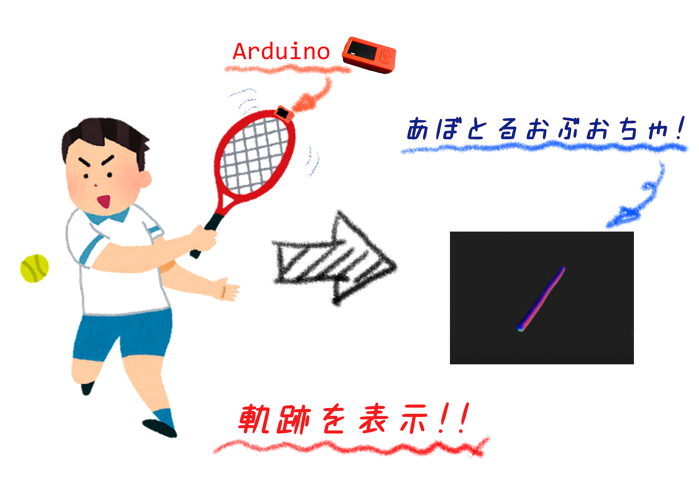
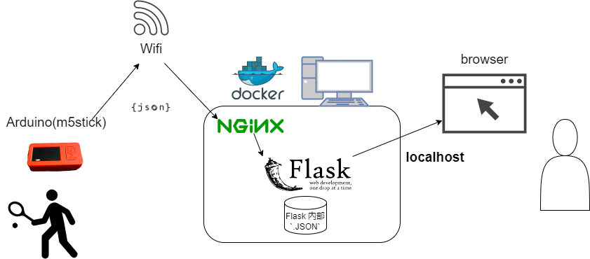

# What is this?

## あぼとるおぶおちゃ!

# 概要

- **あぼとるおぶおちゃ** はラケットを振ると、センサを使って軌跡を表示することができるものです!!


https://github.com/EaGitro/a-bottle-of-ocha_m5stick_tennis/assets/97268187/4eced695-3977-4f98-a05b-215afde79565

<BR>




# 詳細


## 概説

- Arduino を用いて、加速度を取得し、それを基にブラウザ上で軌跡を表示します。
- テニスラケットの動きを可視化することを目標に、さらにそれに楽しさを加えました。


## 仕組み詳細




### 仕組み概要
- まず Arduino から加速度データを JSON でサーバに送る。その際には Wifi を用いる
    - 通信方式は `HTTP(POST)` である
- サーバは Flask を用いて構築されている。サーバごと Docker を用いて仮想化されているため、ポートを解放することができる
    - はじめはサーバを PythonAnywhere というホスティングサービスを用いて公開しようとしたが、連続して大量に送ることができないため、 Docker を用いて local で構築した
- Flask であるため、バックエンドもフロントエンドも同じサーバを用いている。
    - ブラウザ上での閲覧には `localhost` を用いる
    - バックエンド:
        - Arduino からデータを受け取る
        - データを JSON ファイル形式で5つ分保持する
        - フロントエンドにデータを渡す用のエンドポイントを持つ
    - フロントエンド:
        - バックエンドからデータを`fetch`する
        - 軌跡を計算し描画する

### Arduino

- 加速度データをJSONにして POST している
- データの作成
    - 10ms に一回データを採取する
    - それを20回繰り返す
    - $10 \times 20ms = 200ms$ 秒に1回サーバへデータを送っている
- Arduino のハード的な制約(メモリサイズ)により、以下のデータ量がギリギリである
- 送るデータのフォーマット
    ```JSON
    /**
     * データ型
     *   UINT: 正の整数
     *   SIGNED_FLOAT: 浮動小数点数
     */
    {
        term_cnt: UINT,
        freq: 20,
        delay: 10,
        moments:[
            {cnt: UINT, ms: UINT, acc:[SIGNED_FLOAT, SIGNED_FLOAT, SIGNED_FLOAT], gyro:[SIGNED_FLOAT, SIGNED_FLOAT, SIGNED_FLOAT]},
            {...},
        ]
    }`
    ```
    - `term_cnt`: このデータは Arduino の電源を入れてから何回目のデータか
    - `freq`: 1回の送信で何回データを採取するか(この後の `moments` の長さでもある)
    - `delay`: 何ミリ秒に一回データを採取するか
    - `moments`: データ本体
        - `cnt`: 1回の送信のなかで何回目のデータか
        - `ms`: 起動してからなんミリ秒経ったか
        - `acc[x,y,z]`: x軸 y軸 z軸の加速度
        - `gyro[x,y,z]`: 各速度、今回は不使用

- 送るデータの例
    ```JSON
    {
        "term_cnt": 6,
        "freq": 10,
        "delay": 50,
        "moments": [
            {
                "cnt": 0,
                "ms": 14911,
                "acc": [
                    -0.38623,
                    -0.13843,
                    0.94824
                ],
                "gyro": [
                    37.96387,
                    123.53516,
                    -0.97656
                ]
            },
            /**
             * 省略
             */
            {
                "cnt": 8,
                "ms": 15312,
                "acc": [
                    -0.70630,
                    -0.14038,
                    0.79834
                ],
                "gyro": [
                    2.99072,
                    23.25439,
                    7.38525
                ]
            },
            {
                "cnt": 9,
                "ms": 15362,
                "acc": [
                    -0.66382,
                    -0.13623,
                    0.85327
                ],
                "gyro": [
                    -9.82666,
                    20.56885,
                    1.95312
                ]
            }
        ]
    }
    ```


### エンドポイント

flask サーバのエンドポイントを述べる

- `/m5stick_tennis/post` : Arduino からデータを受け取る
- `/m5stick_tennis/data` : JSONデータを返す (これをフロントで `fetch` する)
- `/(root)` : フロントエンド、表示

